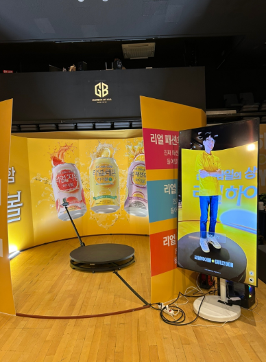
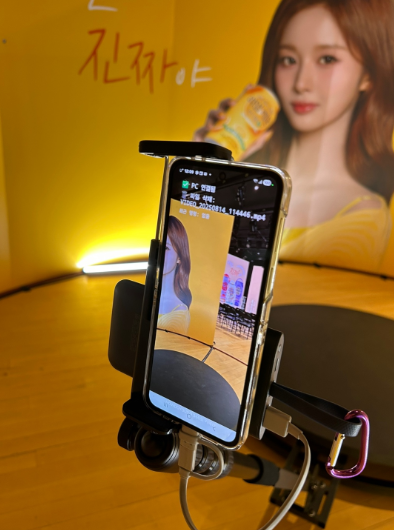
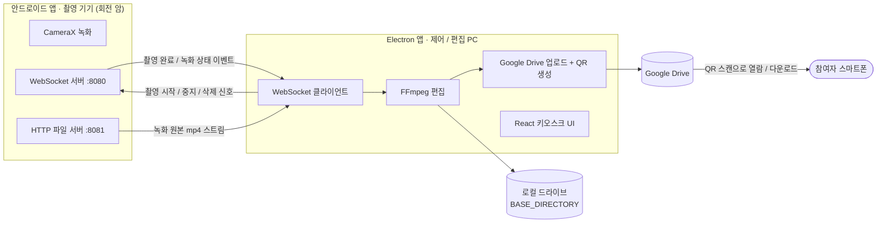
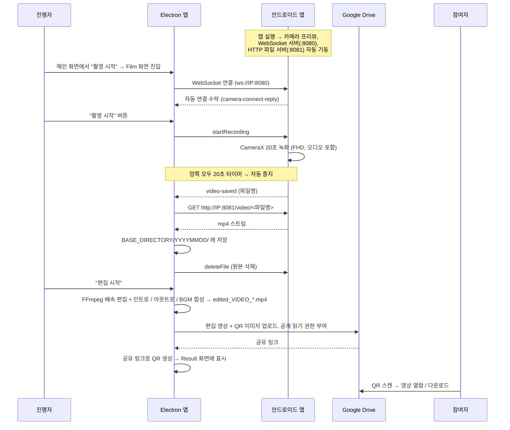
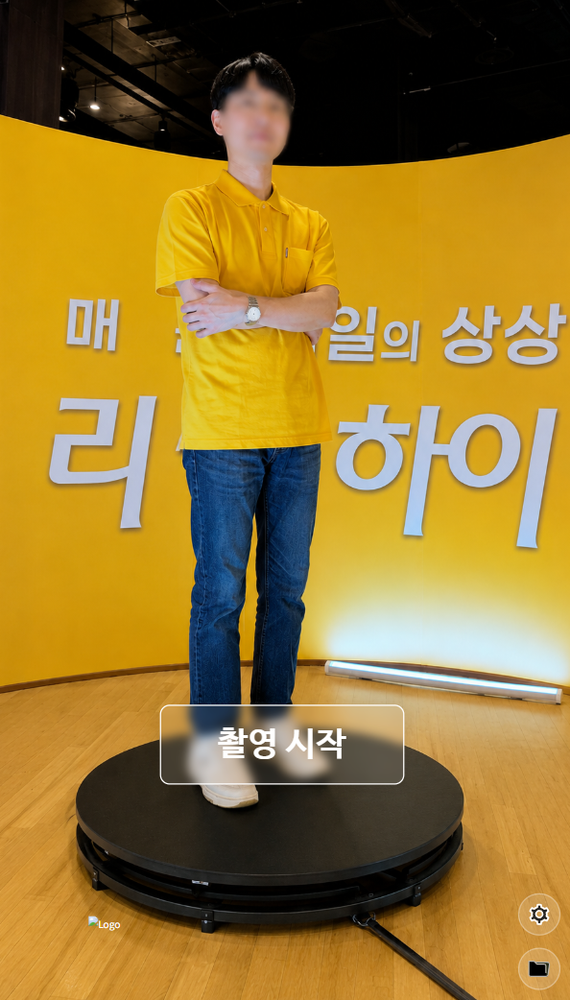
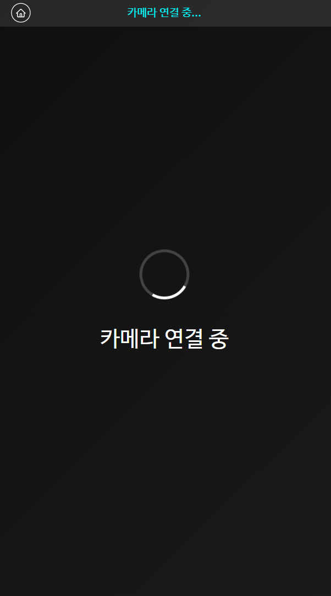

# 360도 촬영 및 편집 애플리케이션

(주)하우두유두 이벤트 부스에서 사용된 360도 회전 촬영 시스템입니다.
행사장에 설치한 회전 암(arm)에 스마트폰을 장착해 참여자를 촬영하고, 촬영된 영상을
자동으로 편집·업로드한 뒤 QR 코드로 전달합니다.

시스템은 두 개의 애플리케이션으로 구성됩니다.

- **안드로이드 앱** – 회전 암에 장착된 스마트폰에서 실행되며, 실제 촬영을 담당합니다.
- **Electron 데스크톱 앱** – 진행자가 조작하는 제어·편집 PC에서 실행되며, 촬영 신호 송신,
  영상 다운로드, 편집, QR 생성, Google Drive / 로컬 저장을 담당합니다.

두 앱은 같은 네트워크에서 WebSocket으로 제어 신호를 주고받고, 녹화 원본은 안드로이드의
HTTP 파일 서버를 통해 PC로 전송됩니다. 참여자는 생성된 QR 코드로 편집 영상을 열람하고
다운로드할 수 있습니다.

<br/>

## 시연 및 사용 (2025.08.14 성암아트홀 설윤 하이볼 팬미팅)

<div align="center">
  
  
</div>

---

## 목차

- [주요 기능](#주요-기능)
- [시스템 구성](#시스템-구성)
- [동작 흐름](#동작-흐름)
- [화면 구성](#화면-구성)
- [프로젝트 구조](#프로젝트-구조)
- [기술 스택](#기술-스택)
- [통신 프로토콜](#통신-프로토콜)
- [영상 편집 파이프라인](#영상-편집-파이프라인)
- [설정](#설정)
- [빠른 시작](#빠른-시작)
- [빌드](#빌드)
- [라이선스](#라이선스)

---

## 주요 기능

### 안드로이드 앱

- **자동 연결**: 앱 실행 시 WebSocket 서버와 HTTP 파일 서버를 자동으로 띄우고, PC가 접속하면
  별도 확인 없이 즉시 연결을 수락합니다.
- **원격 촬영**: PC의 촬영 시작·중지 신호를 받아 CameraX로 FHD(1920 x 1080) 영상을 녹화합니다.
  20초가 지나면 자동으로 녹화를 종료합니다.
- **임시 저장 및 자동 삭제**: 녹화 파일을 앱 전용 외부 저장소에 임시로 보관하고, PC로 전송이
  끝나면 PC의 삭제 요청에 따라 원본을 제거합니다.
- **상태 표시 및 안정성**: 화면에 PC 연결 상태와 촬영 상태를 실시간으로 표시하며,
  Wi-Fi Lock과 화면 켜짐 유지, Foreground Service로 장시간 운영에 대비합니다.

### Electron 데스크톱 앱

- **키오스크 UI**: 1080 x 1920 세로 전체 화면으로 실행되어 부스 키오스크로 사용합니다.
- **촬영 제어**: 안드로이드 앱과의 연결·재연결, 촬영 시작·중지·재촬영을 진행자가 조작합니다.
- **자동 영상 편집**: 번들된 FFmpeg로 구간별 배속(슬로 모션) 편집 후 인트로·아웃트로·배경음악을
  합성합니다.
- **QR 코드 및 저장**: 편집 영상과 QR 이미지를 Google Drive에 업로드하고 공개 링크를 만든 뒤,
  해당 링크를 담은 QR 코드를 생성해 화면에 표시합니다. 원본·편집본은 로컬 드라이브에도 저장됩니다.
- **영상 관리**: 파일 관리자 모달에서 날짜별 폴더와 편집 영상 썸네일을 확인하고, 노출을 원하지
  않는 참여자의 로컬 영상과 QR 파일을 삭제할 수 있습니다. (Google Drive에 업로드된 영상은
  삭제되지 않습니다.)
- **메인 배경**: 메인 화면은 정적 배경 이미지 위에 촬영 시작 버튼을 표시합니다.

---

## 시스템 구성



- **Electron 앱이 WebSocket 클라이언트**, **안드로이드 앱이 WebSocket 서버**입니다.
- 제어 신호는 `ws://<안드로이드 IP>:8080`, 영상 파일 전송은 `http://<안드로이드 IP>:8081`을 사용합니다.
- Google Drive OAuth 인증 콜백은 PC의 `http://localhost:3000`을 사용합니다.
- 두 기기는 같은 무선 네트워크(LAN)에 있어야 하며, 안드로이드 앱은 평문(HTTP) 트래픽을 허용합니다.

---

## 동작 흐름



단계 요약

1. **기동** – 안드로이드 앱이 카메라 프리뷰, WebSocket 서버, HTTP 파일 서버를 자동으로 시작합니다.
   Electron 앱은 `.env` 설정을 읽어(없으면 기본 파일 생성) IPC 모듈을 로드하고 전체 화면 창을 엽니다.
2. **연결** – Film 화면에 진입하면 Electron 앱이 `.env`의 `WIRELESS_ADDRESS`로 WebSocket 연결을
   시도합니다. 연결 실패 시 최대 2회 자동 재시도하고, 이후에는 수동 재연결 버튼을 노출합니다.
3. **촬영** – 진행자가 촬영을 시작하면 `startRecording` 신호가 전송되고, 안드로이드가 20초간
   녹화합니다. Electron과 안드로이드가 각각 20초 타이머를 두어 자동 종료합니다.
4. **전송** – 녹화가 끝나면 안드로이드가 `video-saved` 이벤트로 파일명을 알리고, Electron이
   `http://IP:8081/video/<파일명>`에서 파일을 내려받아 `BASE_DIRECTORY/YYYYMMDD/`에 저장합니다.
   저장이 끝나면 안드로이드에 원본 삭제를 요청합니다.
5. **편집** – 진행자가 편집을 시작하면 FFmpeg가 두 단계로 처리합니다. 먼저 구간별 배속 편집으로
   슬로 모션을 만들고, 이어서 인트로·아웃트로·배경음악을 합성해 `edited_VIDEO_YYYYMMDD_HHMMSS.mp4`를
   생성합니다.
6. **업로드 및 QR** – 편집 영상과 QR 이미지를 Google Drive의 오늘 날짜 폴더에 업로드하고 "링크가
   있는 모든 사용자" 읽기 권한을 부여합니다. 영상 공유 링크로 QR 코드를 만들어 Result 화면에
   표시합니다.
7. **열람** – 참여자가 QR을 스캔해 Google Drive에서 영상을 재생하거나 내려받습니다.

---

## 화면 구성

Electron 데스크톱 앱은 `HashRouter` 기반으로 세 개의 화면을 가집니다. (`/`, `/film`, `/result`)

<div align="center">
  <table>
    <tr>
      <td align="center">
        
        <br/><strong>메인 (Home, <code>/</code>)</strong>
      </td>
      <td align="center">
        
        <br/><strong>촬영 (Film, <code>/film</code>) · 카메라 연결 중</strong>
      </td>
    </tr>
  </table>
</div>

#### 메인 (Home)

- 배경 이미지 위에 중앙의 **촬영 시작** 버튼으로 Film 화면에 진입합니다.
- **설정(톱니) 버튼**으로 환경 설정 모달(IP, 기본 디렉토리, 저작권 표시, 종료)을 엽니다.
- **폴더 버튼**으로 영상 관리 모달을 열어 날짜 폴더·편집 영상 썸네일을 탐색하고 로컬 영상을
  삭제합니다.

#### 촬영 (Film)

화면 진입 시 자동으로 카메라 연결을 시도하며, 상태에 따라 UI가 전환됩니다.

| 상태 | 표시 |
| --- | --- |
| 연결 중 | 스피너 + "카메라 연결 중" |
| 연결 실패 | 안내 문구 + **재연결** 버튼 |
| 촬영 대기 | "카메라가 연결되었습니다" + **촬영 시작** 버튼 |
| 촬영 중 | 진행 바 + 남은 시간 + **촬영 중지** 버튼 |
| 영상 전송 중 | 스피너 + "영상 전송 중" |
| 촬영 완료 | **재촬영** / **편집 시작** 버튼 |
| 편집 중 | 스피너 + "영상 편집 중..." |

#### 결과 (Result / QR)

- 좌측에 편집된 결과 영상을 재생합니다.
- 우측에 QR 코드를 표시합니다. 업로드·생성이 끝나기 전에는 "QR코드 생성 중" 스피너를 보여 줍니다.
- **메인화면** 버튼으로 Home으로 돌아갑니다.

#### 안드로이드 앱 (촬영 기기)

전체 화면 카메라 프리뷰 위에 상태 오버레이를 표시합니다. 좌측 상단에 PC 연결 상태
(`PC 연결됨` / `PC 연결 대기중`)와 촬영 상태(`촬영 대기` / `PC 제어로 촬영 중`), 우측 상단에
녹화 중 점멸하는 인디케이터가 나타납니다.

---

## 프로젝트 구조

```text
360-kiosk/
├─ electron/                         데스크톱 앱 (Electron + React + Vite)
│  ├─ src/
│  │  ├─ main.ts                     메인 프로세스 진입점, .env 로드/생성, 창 생성
│  │  ├─ preload.ts                  렌더러에 ipcRenderer 노출 (contextIsolation: false)
│  │  ├─ IPC/
│  │  │  ├─ MobileControl.ts         안드로이드 WebSocket 연결, 촬영 신호, 원본 영상 다운로드
│  │  │  ├─ VideoControl.ts          로컬 영상 목록/썸네일/삭제, 배경 영상 조회
│  │  │  ├─ DriveControl.ts          FFmpeg 편집, Google Drive 업로드, QR 생성, OAuth
│  │  │  └─ SettingControl.ts        settings.config.json 읽기/쓰기
│  │  ├─ utils/path-utils.ts         개발/배포 환경별 리소스 경로 계산
│  │  ├─ exe/ffmpeg/                 번들 FFmpeg 실행 파일 (ffmpeg / ffplay / ffprobe)
│  │  ├─ settings.config.json        환경 설정 모달이 사용하는 런타임 설정
│  │  └─ renderer/
│  │     ├─ app.tsx                  HashRouter 라우트 정의 (/, /film, /result)
│  │     ├─ pages/
│  │     │  ├─ Home.tsx              메인 화면
│  │     │  ├─ Film.tsx              촬영 화면
│  │     │  └─ QRPage.tsx            결과 / QR 화면
│  │     ├─ components/              Button, ProgressBar, VideoPlayer, Spinner,
│  │     │                          Header/Footer, SettingsModal, VideoManagementModal 등
│  │     ├─ hooks/
│  │     │  ├─ useCamera.ts          연결/녹화/편집 상태와 액션
│  │     │  ├─ useIPCListeners.ts    메인 프로세스 IPC 이벤트 구독
│  │     │  ├─ useRecordingTimer.ts  20초 녹화 타이머
│  │     │  ├─ useVideo.ts           영상 로드, 업로드, QR blob 처리
│  │     │  ├─ useEnvConfig.ts       get-env-config 결과 로드
│  │     │  └─ useKeyboard.ts        물리 버튼(PageUp) 매핑
│  │     ├─ styles/                  전역 CSS, 폰트
│  │     └─ assets/                  아이콘, 폰트, intro/outro/bgm, 샘플 배경 영상
│  ├─ forge.config.ts                Electron Forge 빌드/패키징 설정
│  ├─ vite.main.config.ts            메인 프로세스 Vite 설정
│  ├─ vite.preload.config.ts         preload Vite 설정
│  ├─ vite.renderer.config.ts        렌더러 Vite 설정
│  ├─ oauth2_credentials.json        Google OAuth 2.0 클라이언트 자격 증명 (직접 준비)
│  └─ package.json
│
├─ mobile_app/                       안드로이드 앱 (Kotlin)
│  ├─ app/src/main/
│  │  ├─ java/com/howdoyoudo/camera_360/
│  │  │  ├─ MainActivity.kt          권한 요청, 카메라 프리뷰, 콜백/옵저버 연결
│  │  │  ├─ CameraXManager.kt        CameraX 프리뷰/녹화 (FHD, 20초 자동 종료)
│  │  │  ├─ IPCService.kt            Foreground Service + WebSocket 서버 (:8080)
│  │  │  ├─ FileServer.kt            NanoHTTPD 파일 서버 (:8081)
│  │  │  └─ CameraViewModel.kt       연결/녹화 상태 LiveData
│  │  ├─ res/layout/activity_main.xml
│  │  └─ AndroidManifest.xml
│  ├─ app/release/app-release.apk    빌드된 APK
│  ├─ build.gradle.kts
│  └─ gradle/libs.versions.toml      버전 카탈로그
│
├─ LICENSE
└─ readme.md
```

---

## 기술 스택

### 데스크톱 앱

| 구분 | 사용 기술 |
| --- | --- |
| 런타임 | Electron 36 |
| 빌드 / 패키징 | Electron Forge 7, Vite 5 플러그인, Squirrel(Windows) / ZIP / Deb / Rpm 메이커 |
| UI | React 19, React Router 7 (HashRouter), TypeScript, SCSS Modules |
| 통신 | `ws` (WebSocket 클라이언트), `axios` (HTTP 다운로드) |
| 영상 처리 | 번들 FFmpeg 실행 파일 |
| 클라우드 | `googleapis` (Drive v3), OAuth 2.0 (`google-auth-library`) |
| QR | `qrcode`, `react-qr-code` |

### 모바일 앱

| 구분 | 사용 기술 |
| --- | --- |
| 언어 / 빌드 | Kotlin, Gradle (Kotlin DSL), 버전 카탈로그 |
| SDK | compileSdk / targetSdk 35, minSdk 24 (Android 7.0) |
| 카메라 | CameraX (`camera-video`, `camera-lifecycle`, `camera-view`) – FHD 녹화 |
| 통신 | Java-WebSocket (서버), NanoHTTPD (HTTP 파일 서버) |
| 상태 관리 | AndroidX Lifecycle (ViewModel, LiveData), ViewBinding |
| 백그라운드 | Foreground Service (`foregroundServiceType="camera"`), Wi-Fi Lock, WakeLock |

---

## 통신 프로토콜

### WebSocket (Electron 클라이언트 ↔ 안드로이드 서버, 포트 8080)

**PC → 안드로이드** – `{ "channel": string, "payload": object }`

| channel | 설명 |
| --- | --- |
| `ping` | 연결 확인 |
| `startRecording` | 녹화 시작 |
| `stopRecording` | 녹화 중지 |
| `deleteFile` | `payload.fileName` 원본 삭제 |

**안드로이드 → PC** – `{ "eventName": string, "data": object }`

| eventName | 설명 |
| --- | --- |
| `camera-connect-reply` | 연결 수락/거부 결과 (`data.success`) |
| `pong` | `ping` 응답 |
| `camera-recording-status` | 녹화 시작/종료 상태 (`data.isRecording`) |
| `video-saved` | 녹화 완료, `data.fileName` / `data.fileSize` |
| `camera-status` | 연결 직후 기기/앱 정보 |
| `file-delete-result` | 원본 삭제 처리 결과 |

### HTTP 파일 서버 (안드로이드, 포트 8081, NanoHTTPD)

| 메서드 · 경로 | 설명 |
| --- | --- |
| `GET /status`, `GET /` | 서버 상태와 영상 파일 목록(텍스트) |
| `GET /list` | 영상 파일 목록(JSON) |
| `GET /check` | 저장 디렉토리 / 권한 점검 (로그 출력) |
| `GET /video/<파일명>` | 녹화 mp4 다운로드 (CORS 허용, 청크 응답) |

파일명은 `..` 또는 경로 구분자를 포함할 수 없습니다.

### Electron IPC 채널 (요약)

| 모듈 | 주요 채널 |
| --- | --- |
| `main.ts` | `get-env-config`, `exit-app` |
| `MobileControl` | `camera-connect`, `reconnect-to-camera`, `check-connection-status`, `camera-record-start`, `camera-record-stop`, `copy-video-from-android`, `clear-android-video`, `change-android-ip`, `check-android-server-status` · (렌더러로 전송) `camera-connect-reply`, `camera-record-complete`, `camera-recording-status`, `video-saved` |
| `VideoControl` | `get-latest-background-video`, `get-directory-contents`, `delete-video` |
| `DriveControl` | `edit-video`, `find-latest-video`, `get-video-blob`, `upload-video-and-qr`, `get-qr-blob`, `clear-local-video`, `check-drive-auth`, `reauthorize-drive` |
| `SettingControl` | `get-connection-ip`, `set-connection-ip`, `get-directory-path`, `select-and-set-directory`, `get-copyright-setting`, `toggle-copyright-setting`, `get-all-settings`, `reset-settings` |

---

## 영상 편집 파이프라인

`edit-video` 요청 시 FFmpeg가 두 단계로 실행됩니다. 모든 출력은 1080 x 1920 세로로 크롭·스케일됩니다.

**1단계 – 구간별 배속(슬로 모션) 편집**

원본에서 아래 구간을 잘라 이어 붙입니다. (원본 녹화 길이는 약 20초)

| 원본 구간 | 배속 | 결과 길이 |
| --- | --- | --- |
| 2.5s – 6.5s | 0.5x (슬로) | 8s |
| 6.5s – 8.5s | 1.0x | 2s |
| 8.5s – 12.5s | 0.5x (슬로) | 8s |
| 12.5s – 17.5s | 1.0x | 5s |

→ 약 23초 분량의 본편(`temp_main_*.mp4`) 생성. `libx264`, CRF 22, `yuv420p`, 오디오 제거.

**2단계 – 인트로 / 본편 / 아웃트로 / 배경음악 합성**

- `assets/videos/intro.mp4` + 본편 + `assets/videos/outro.mp4`를 순서대로 연결
- `assets/videos/bgm.mp3`를 0~35초로 자르고 앞뒤 1초 페이드, 볼륨 0.8로 믹스
- `libx264` CRF 20, `-tune film`, `aac` 192k / 48kHz, `+faststart`
- 결과: `edited_VIDEO_YYYYMMDD_HHMMSS.mp4`

임시 파일(`temp_main_*.mp4`)은 합성 후 삭제됩니다.

---

## 설정

### `.env` (Electron, 시작 시 로드)

`electron/.env`가 없으면 앱이 기본 파일을 생성합니다. 배포 빌드에서는
`resources/.env`를 사용합니다. 값을 바꾼 뒤에는 앱을 재시작해야 적용됩니다.

| 키 | 설명 |
| --- | --- |
| `WIRELESS_ADDRESS` | 안드로이드 기기 IP. WebSocket / HTTP 서버 주소의 기준 |
| `BASE_DIRECTORY`, `VITE_BASE_DIRECTORY` | 원본·편집 영상이 저장될 로컬 폴더 (하위에 `YYYYMMDD` 폴더 생성) |
| `DRIVE_FOLDER_ID` | 업로드 대상 Google Drive 최상위 폴더 ID (`drive/folders/` 뒤의 문자열) |
| `copyright` | `true`면 화면 하단에 저작권 표기 노출 |
| `NODE_ENV` | 패키징 상태에 따라 자동 설정 (수정하지 않음) |

경로에 역슬래시를 쓸 때는 `C:\\videos\\original`처럼 두 번씩 입력합니다.

### `settings.config.json` (환경 설정 모달)

메인 화면의 설정 버튼으로 여는 모달이 사용합니다. 개발 환경은 `electron/src/settings.config.json`,
배포 환경은 `resources/settings.config.json`을 읽고 씁니다.

| 키 | 설명 |
| --- | --- |
| `connection_ip` | 모달에서 입력·저장하는 연결 IP |
| `directory_path` | 디렉토리 선택 다이얼로그로 지정하는 기본 폴더 |
| `copyright` | 저작권 표시 토글 |
| `DRIVE_FOLDER_ID` | Drive 폴더 ID |

> 네트워크 연결의 기준값은 `.env`의 `WIRELESS_ADDRESS`입니다. 운영 시에는 `.env`를 정확히
> 설정해 주세요.

### Google Drive OAuth 2.0

- `electron/oauth2_credentials.json`에 OAuth 클라이언트 자격 증명(`web` 또는 `installed`)을 둡니다.
  리디렉션 URI에 `http://localhost:3000`을 포함해야 합니다.
- 최초 업로드 시 브라우저로 동의 화면이 열리고, 발급된 토큰은 사용자 데이터 폴더의
  `google_drive_token.json`에 저장됩니다. 만료 시 refresh token으로 자동 갱신하며, 실패하면
  `reauthorize-drive`로 재인증합니다.
- 업로드된 영상·QR 이미지에는 "링크가 있는 모든 사용자" 읽기 권한이 부여됩니다.

---

## 빠른 시작

### 필요 조건

- Node.js 18 이상, npm
- Windows (데스크톱 앱은 세로 키오스크 화면과 번들 FFmpeg(.exe) 기준)
- Android Studio (모바일 앱 빌드 시)
- Google Cloud OAuth 2.0 클라이언트 자격 증명

### 데스크톱 앱 실행

```bash
git clone https://github.com/sub9707/360-kiosk
cd 360-kiosk/electron

npm install

# electron/.env, electron/oauth2_credentials.json 준비
# (.env가 없으면 첫 실행 시 기본 파일이 생성되므로 이후 값 수정)

npm start
```

### 모바일 앱 실행

1. `mobile_app/`을 Android Studio로 엽니다.
2. 촬영용 스마트폰을 제어 PC와 같은 Wi-Fi에 연결합니다.
3. 앱을 설치·실행하고 카메라·오디오·저장소 권한을 허용합니다.
4. 기기 IP를 확인해 데스크톱 앱의 `.env` `WIRELESS_ADDRESS`에 입력합니다.
5. 빌드된 APK는 `mobile_app/app/release/app-release.apk`에도 있습니다.

---

## 빌드

### 데스크톱 앱

```bash
cd electron
npm run package   # 패키징만
npm run make      # 설치 파일 생성 (Windows: Squirrel)
```

`forge.config.ts`의 `extraResource`로 FFmpeg, `.env`, OAuth 자격 증명, 렌더러 assets가
`resources/`에 포함됩니다.

### 모바일 앱

```bash
cd mobile_app
./gradlew assembleRelease
```

서명 키는 `mobile_app/key/key.jks`를 사용합니다.

---

## 라이선스

MIT License. 자세한 내용은 [LICENSE](LICENSE) 파일을 참고하세요.

작성자: 김승섭 (sub9707)
